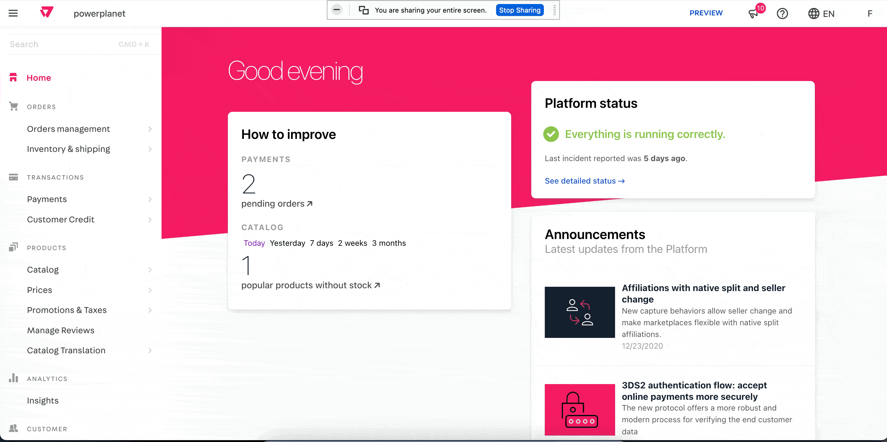

# Catalog Translation Admin

The catalog translation app provides a way to read and update `Categories` and `Products` information for all bindings associated to an account. It uses the `catalog translation` queries on `vtex.catalog-graphql` instead of `messages app` so all the SEO relevant content is translated.



---
## Description

There are two different pages for `Category` and `Product` translations. Both display a list of bindings for the store. The first one is always the `X-Vtex-Tenant` and the details cannot be translated. For all the others, it's possible to edit the content. 

---
## Usage

Using [VTEX IO Toobelt](https://vtex.io/docs/recipes/development/vtex-io-cli-installation-and-command-reference/#command-reference) log into the VTEX account you are working on and install the latest version:

```
$ vtex install vtex.admin-catalog-translation
```

---

## Knowing issue

It's not possible to add content for a specific field if there is no content for that same field in the `X-Vtex-Tenant` binding.
